# Actividad 1. Empezando con el desarrollo web frontend

Rellena la siguiente tabla describiendo los siguientes términos relacionados con el desarrollo Web. Para cada uno de ellos debes indicar su propósito, si pertenecen al lado servidor o cliente y al menos dos características diferenciadoras.

| Término      | Descripción y propósito | Cliente/Servidor | Característica 1 | Característica 2 |
|--------------|-------------------------|------------------|------------------|-------------------|
| **HTML5**    | Lenguaje de marcas que define el significado y la estructura del contenido web | Cliente | Es el estándar más reciente | Soporte multimedia sin plugins (audio, video) |
| **JavaScript** | Lenguaje de secuencias de comandos que te permite crear contenido de actualización dinámica, controlar multimedia, animar imágenes y prácticamente todo lo demás | Cliente | Manipulación del DOM desde el navegador | Funciona en todos los navegadores |
| **ECMAScript** | Término que designa al estándar del lenguaje Javascript | Cliente | Garantizar la interoperabilidad de páginas web en diferentes navegadores web | Define la sintaxis y funcionalidad del lenguaje Javascript |
| **TypeScript** | Superset de JavaScript que incorpora tipos estáticos para detectar errores antes de ejecutar el código | Cliente | Añade tipado estático | Facilita el desarrollo de aplicaciones de gran escala |
| **PHP** | Lenguaje de script de código abierto del lado del servidor que puede integrarse en HTML para crear aplicaciones web y sitios web dinámicos | Servidor | Genera contenido dinámico en el servidor | Compatible con bases de datos como MySQL |
| **CSS** | Lenguaje de estilo que define la apariencia y diseño de un sitio web | Cliente | Separa el contenido de su presentación visual | Facilita la personalización del estilo |
| **SASS** | Preprocesador de CSS que permite escribir CSS de manera más eficiente y reutilizable | Cliente | Características avanzadas, como variables | Compila a CSS para usarse en el navegador |
| **jQuery** | Biblioteca de JavaScript que simplifica la manipulación del DOM | Cliente | Soporte sencillo para AJAX | Simplifica la manipulación del DOM |
| **Node.js** | Entorno de ejecución de JavaScript en el lado del servidor | Servidor | Permite usar JavaScript en el backend | Ideal para aplicaciones en tiempo real y escalables |
| **React.js** | Biblioteca de JavaScript para construir interfaces de usuario interactivas | Cliente | Facilita la creación de interfaces de usuario dinámicas | Usa un DOM virtual para mejorar el rendimiento |
| **AJAX** | Técnica para realizar peticiones asíncronas al servidor sin recargar la página completa | Cliente/Servidor | Actualizar contenido sin recargar la página | Utiliza XML o JSON para intercambiar datos |
| **Fetch API** | Interfaz de JavaScript para hacer peticiones HTTP asíncronas | Cliente | Promesas nativas de JavaScript para manejar peticiones | Manejo de errores simplificado frente a XMLHttpRequest |
| **WebSocket** | Protocolo que permite la comunicación bidireccional en tiempo real entre el cliente y el servidor | Cliente/Servidor | Comunicación persistente y bidireccional | Apto para aplicaciones con baja latencia |
| **Web Worker** | Tecnología que permite ejecutar scripts en segundo plano sin bloquear la interfaz de usuario | Cliente | Procesamiento en segundo plano | No tiene acceso directo al DOM |

#
# Actividad 2. Uso básico del navegador para el desarrollo web

Utilizando las herramientas de desarrollo de tu navegador realiza las siguientes acciones. Para dicha actividad, adjunta capturas de pantalla que se correspondan con cada uno de los puntos de la actividad.

1. **Modificar el contenido de un elemento HTML de un sitio web.**

   **FilmAffinity antes del cambio:**

   <center></center>

   **FilmAffinity después del cambio:**

   <center></center>

   **Líneas cambiadas:**

   - **Originales:**
     ```html
     <strong>Iniciar sesión</strong>
     <a href="https://www.filmaffinity.com/es/calendar-tv.php">Calendario de series de TV</a>
     ```

   - **Cambios hechos por mí:**
     ```html
     <strong>Login</strong>
     <a href="https://www.filmaffinity.com/es/calendar-tv.php">Calendario series de plataformas de streaming</a>
     ```

2. **Modificar una clase CSS de un sitio web.**

   Por ejemplo, cambiando el color del texto o de un fondo.

   **FilmAffinity antes del cambio:**
    <center>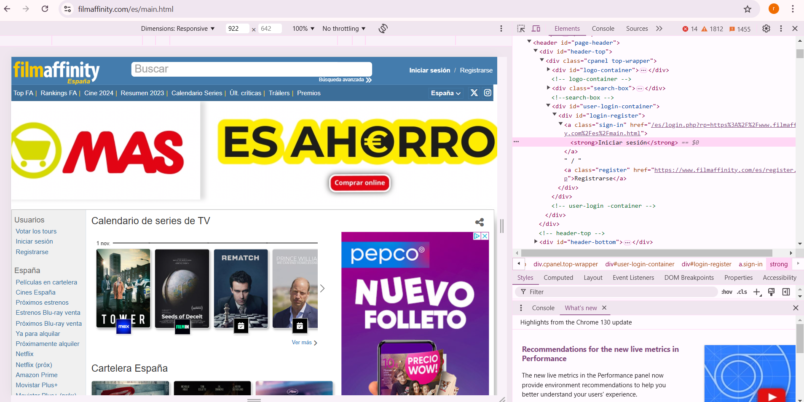</center>
   

   **FilmAffinity después del cambio:**
    <center>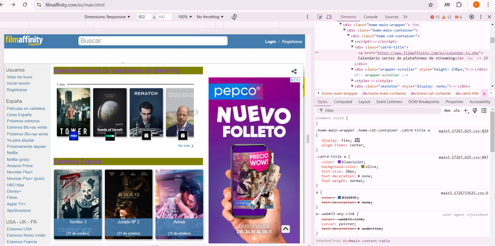</center>
   

   - **Original:**
   ```css
   .catrd-title a {
       color: black;
       font-size: 20px;
       text-decoration: none;
       font-weight: normal;
   }
   ```

    - **Cambio hecho por mí**
    ```css
    .catrd-title a {
    color: blueviolet;
    background-color: olive;
    font-size: 20px;
    text-decoration: none;
    font-weight: normal;
    }
    ```

3. **Inspecciona los archivos javascript y CSS de un sitio web.**
  - JS:
    <center>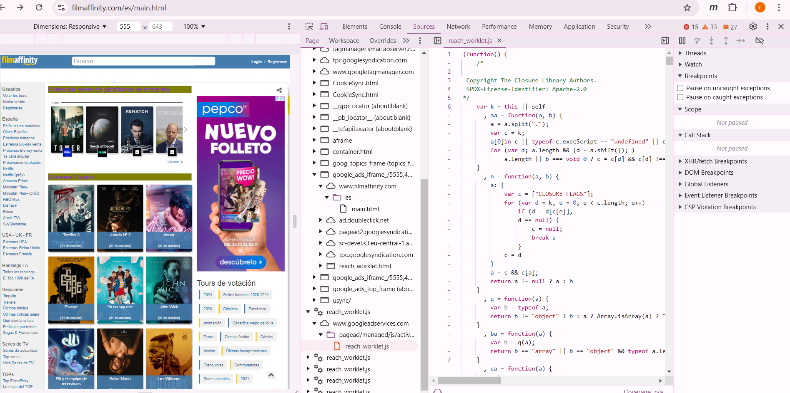</center>

  - CSS:
    <center>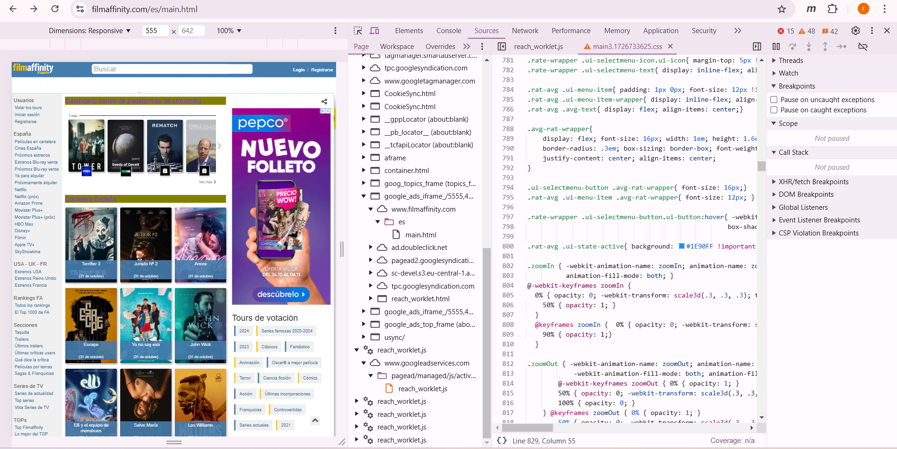</center>

4. **Realiza una operación aritmética en la consola**
  <center>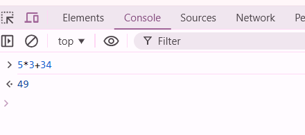</center>

5. **Inspecciona todas cookies utilizadas por el sitio web https://www.lavozdealmeria.com/.**
  <center>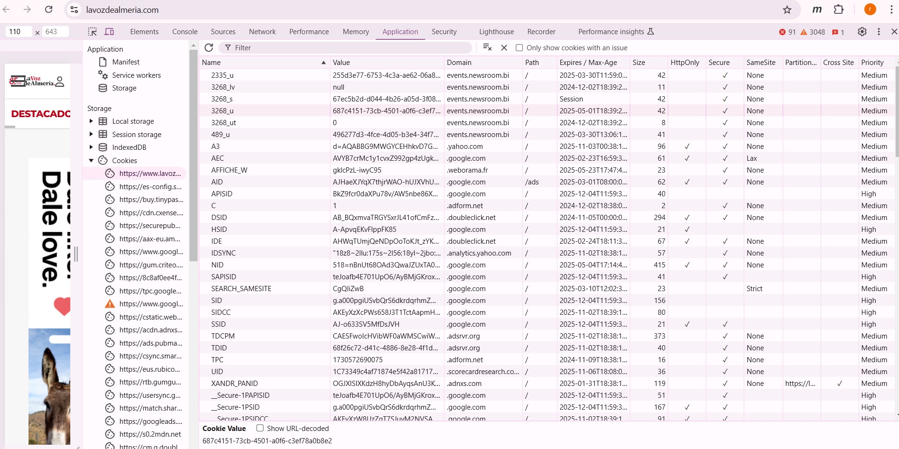</center>

6. **Desactiva el uso de la caché, en el apartado red**
  <center>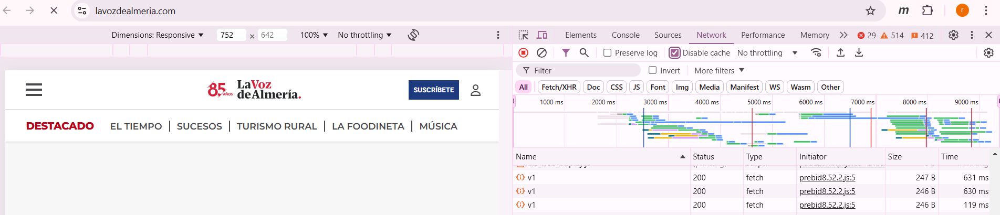</center>


#
# Actividad 3. Puesta en marcha

1. **Realiza y documenta la puesta en marcha Visual Studio Code, con al menos 3 de sus extensiones relacionadas con el desarrollo en Web con JS (p. ej. JavaScript (ES6) code snippets, git, etc.) detallando sus funcionalidades.**
  - Instalación de Visual Studio Code (debido a que ya poseía con anterioridad VSC, detallaré los pasos por escrito):
    1. Descarga de Visual Studio Code desde https://code.visualstudio.com/ 
    2. Sigue las instrucciones del instalador, en estas podrás cambiar la ubicación de la carpeta raíz de la aplicación, donde se encontrará esta o el icono de la misma.

  - Extensiones:
    1. JavaScript (ES6) Code Snippets: Proporciona fragmentos de código predefinidos para JavaScript, especialmente útil para escribir código de manera más rápida. Incluye atajos para sintaxis de JavaScript moderno, como console.log, declaraciones for y function. Mejora la productividad al evitar escribir código repetitivo.
      <center>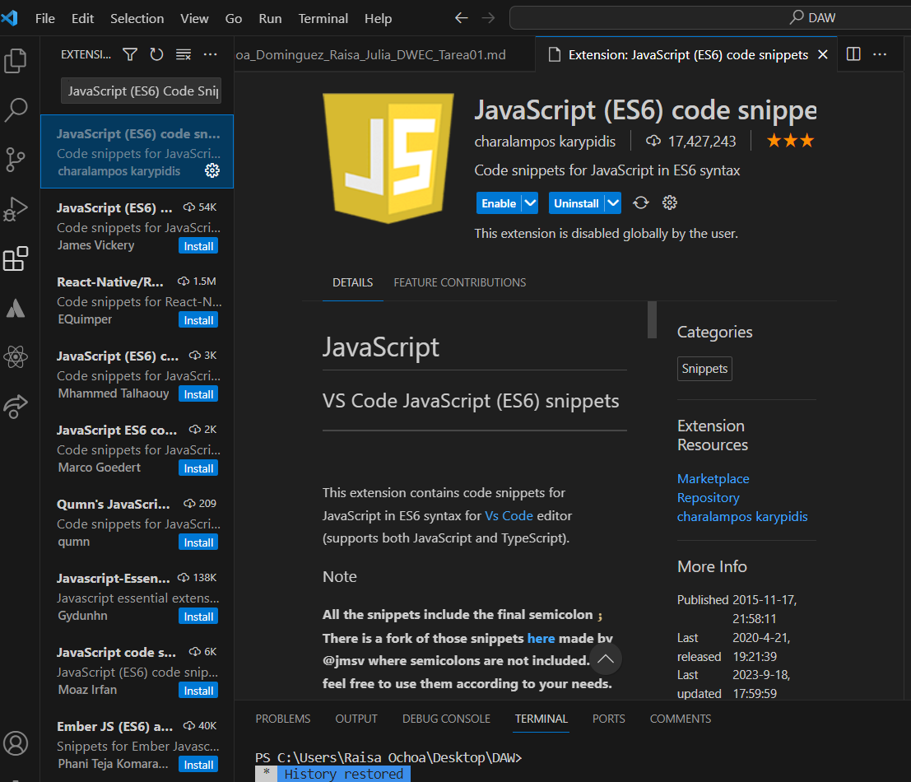</center>

    2. Live Server: Permite lanzar un servidor local y recargar la página automáticamente cuando se detectan cambios en los archivos HTML, CSS y JS. Ideal para el desarrollo web, ya que permite ver cambios en tiempo real sin necesidad de recargar manualmente el navegador. Funciona activando el servidor desde la barra inferior de VS Code.
      <center>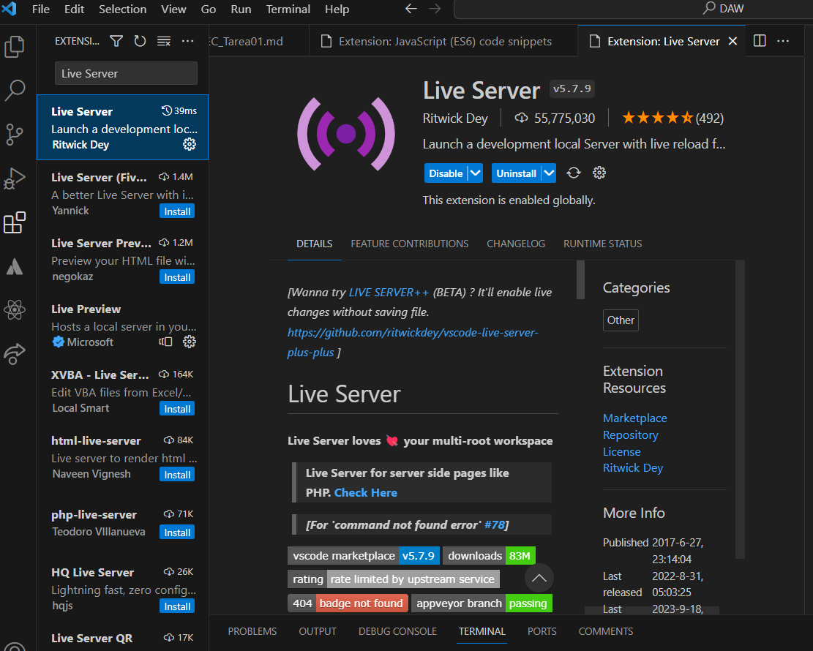</center>

    3. Prettier - Code formatter: Formatea automáticamente el código para mantener un estilo consistente. Admite múltiples lenguajes, incluidos HTML, CSS y JavaScript. Facilita la legibilidad del código y mejora la calidad del proyecto, especialmente en equipos de desarrollo.
      <center>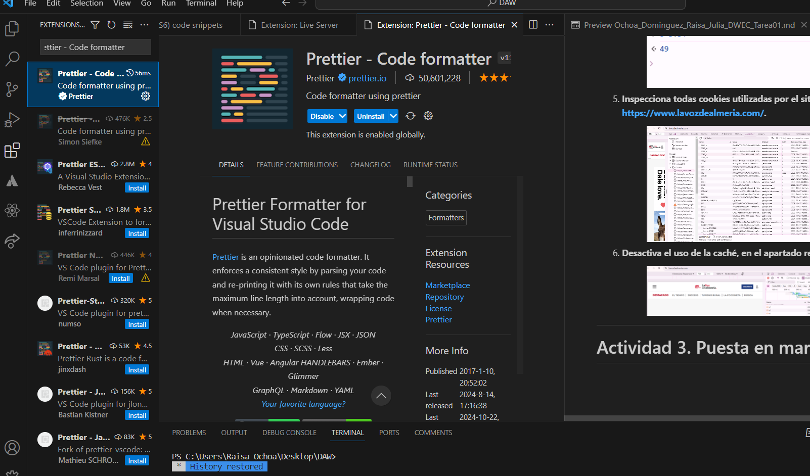</center>

2. **Realiza una primera web compuesta por dos ficheros (index.html y main.js) que muestre el mensaje "Hola mundo" al usuario a través de consola utilizando JavaScript. Ejecútalo en el navegador web.**
  <center>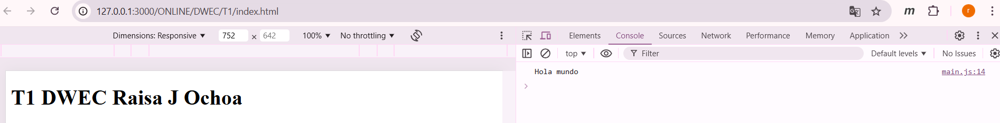</center>

3. **Ejecuta el script anterior desde la consola de visual studio (node + script.js).**
  <center>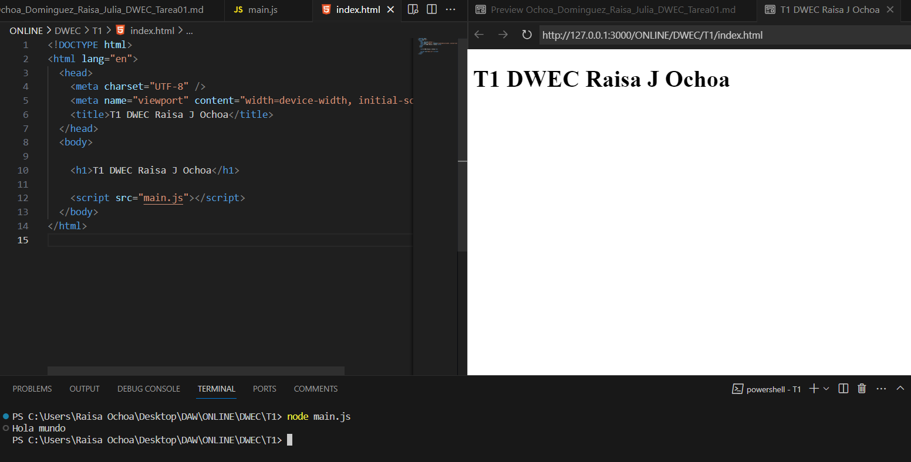</center>

4. **Sincroniza tu proyecto "Hola mundo" con un repositorio con tu github (https://github.com/) y publica la página (https://docs.github.com/es/pages/getting-started-with-github-pages/creating-a-github-pages-site).**

